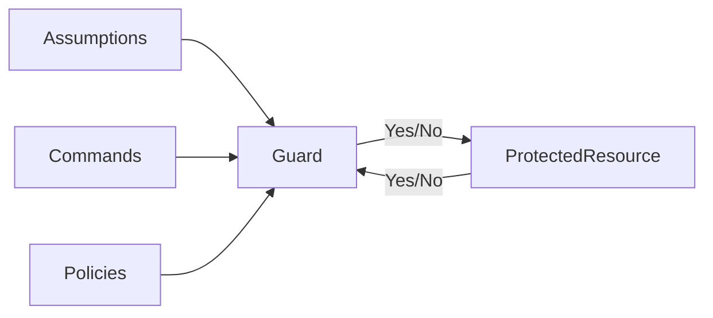
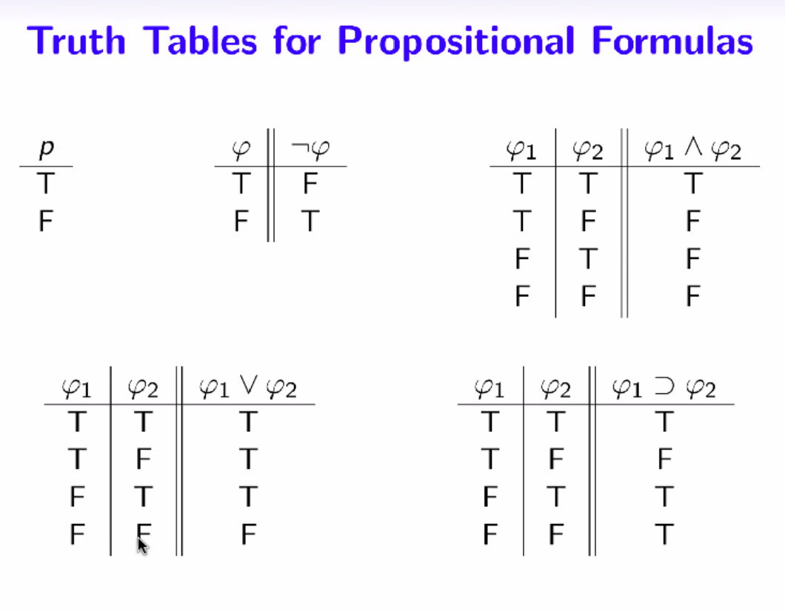
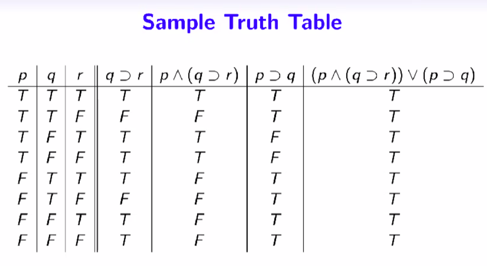

# Week 1 Introduction
## Table of Contents
- **&rarr;[Week 1 Introduction](README.md)**
- [Week 2 Beginning Steps](../week2/README.md)
- [Week 3 Programming Paradigms Part 1](../week3/README.md)
- [Week 4 Formal Methods and Programming](../week4/README.md)
- [Week 5 Applying Formal Methods Part 1](../week5/README.md)
- [Week 6 Applying Formal Methods Part 2](../week6/README.md)
- [Week 7 Programming Paradigms Part 2](../week7/README.md)
- [Week 8 Applying Formal Methods Part 3](../week8/README.md)
- [Week 9 Applying Formal Methods Part 4](../week9/README.md)
- [Week 10 Applying Formal Methods Part 5](../week10/README.md)

> Learning Objectives and Outcomes
> After completing the coursework for week 1 successfully, a student will be able to:
> 
> - Recall the definitions and basic properties of the following discrete structures: sets, relations, and functions.
> - Explain the main ideas of the functional programming paradigm by using Haskell programming examples.
> - Identify access control as a crucial aspect of security requirement for people who specify, design, build or certify computer and information systems.
> - Describe a logical approach to study access control and state its merits.

### Motivations

Programming, Formal Methods, and Secured Systems

#### Programming

- Emphasize good practices for program development
  - abstraction, design, specification, testing, verification
- study new programming techniques
  - support good program development practices
- skills to support a secured system
  - program correctness
  - dependable software

#### Formal Methods
- mathematical techniques for the formal specification and development of software/hardware systems; it typically includes

- formal specification language
  - expresses what the system does
  - expresses properties the system should have
- verification tools
  - proof of properties of the specification
  - test the properties of the specification

#### Secured Systems
- Focus on access control, a fundamental topic in secured system
- study policies and mechanisms that permit or deny the use of a resource or capability
- examine a logic developed for access control (a formal method) and use it
  - to formulate access control policies and to describe access control mechanisms
  - as a reasoning tool to help making access control decisions for a secured system

#### additional information

- https://www.haskell.org/
- https://public.cyber.mil/ncae-c/
- https://www.youtube.com/watch?v=MK0SrxBC1xs

### Mathematical Background

#### Overview

Prerequisite: discrete mathematics:
- logic
- sets
- functions
- relations


#### Mathematical Notions and Terminology
Be familiar with the notions and terminology that are used in the following core areas:
- logic
- sets
- functions
- relations


#### Definitions, theorems, and proofs
- definitions: write precise mathematical statements to describe the objects and notions we use
- theorems: correctly interpret theorems (mathematical statements proved true), including the complex ones that comes with lemmas and corollaries
- proofs: able to verify proofs (logical arguments that demonstrate a statement is true)

#### Types of Proof
You can identify the types of proof and know the required steps when verifying if the proof is correct, types of proofs includes:
- proof by contradiction
  - example: show that $p\lor{}\neg{}p$ is tautology by constructing its truth table
- proof by contradiction
  - example: prove that the square root of 2 is irrational
- proof by induction \*\*
  - important for this class
  - presents itself as recursion in programming


### Sets
#### Basic Set Notation
 
a set is an unordered collection of elements
- {x,y,z} is a set containing three elements
- {} is an empty set
- we write $x\in{S}$
- subset notation:
  - ${|x\in{A}}$ P(X) is true

#### Subsets

- S is a subset of T, written $S\subset{T}$


#### Power set
$P(\empty)=\{\empty\}$

#### Basic Set Operations

| Notion           | Notation | Definition                            |
|------------------|----------|---------------------------------------|
| Union            | S ∪ T    | S ∪ T = {x \| x ∈ S or x ∈ T}         |
| Intersection     | S ∩ T    | S ∩ T = {x \| x ∈ S and x ∈ T}        |
| Set Difference   | S - T    | S - T = {x \| x ∈ S and x ∉ T}        |
| Cartesian Product| S × T    | S × T = {(x,y) \| x ∈ S and y ∈ T}    |


### Functions
- The concept of functions is central to mathematics and computer science
  - a function **f** is:
    - an object to describe an input-output relationship
    - f(x)=y
- **f** is a function from a set **A** (domain) to a set **B** (range)

#### Function Composition

Suppose that f: A&rarr;B, g: B&rarr;C are functions.
- The **composition of functions** f and g is the function h (h: A&rarr;C)= g(f(x))
Remarks
- a simple wat for structuring the design of a program
  - the program is written as a pipeline of operations
  -easy to see how such designs can be modified
- the composition operator &compfn; is:
  - high order function
  - associative

- f&compfn;g&compfn;h=(f&compfn;g)&compfn;h=f&compfn;(g&compfn;h)

- f&compfn;g=f(g(x))

### Relations

#### Binary Relations
- a binary relation over a set A is a set R AxA
- Suppose a &in;A. The image of relation R under a is 
  - R(a)={b|(a,b)&in;R}

#### Relational Composition
Suppose that R and S are binary relations over A

- Their composition is the relation R&compfn;S={(x,z)|&exist;y((x,y)&in;R and (y,z)&in;S)}

#### Notation Notes
- (a,b) &ne; (b,a) ordered pair
- {a,b} = {b,a} two-element set
- [a,b] not talking about this right now
- {} empty set
- {{}} one element set containing an empty set


### Functions and Functional Programming


#### Pure Functions, Part 1

- Procedural programming, functions we develop often come with side effects, for example:
  - an interactive  program that reads from the keyboard and writes to the screen as they are running
  - a function that modifies state variable value/arguments passed and has consequence beyond its scope
- Functions that do not have side effects are referred to as pure functions

#### Pure Functions, Part 2

- Pure functions are important in functional programming and formal methods, some benefits are:
  - simple and precise
  - easy to test and verify
  - easy to refactor
- it is easier to reason about programs when they are pure functions

#### Pure Functions, Part 3

- remarks
  - the haskell programs that you learn in this class are pure functions
  - while we focus on pure functions in class, one can also use Haskell to write interactive programs (Hutton, chapter 10)
  - Haskell is also a pure functional language. This means that is has no variable assignments

[1.4.2 example](./1-4-2-example.pdf)


### Programming in Haskell

#### what is a functional language?
- Opinions differ, and it is difficult to give a precise definition, but generally speaking:
  - Functional programming is a **style** of programming in which the basic method of computation is the application of functions to arguments
  - a functional language is one that **supports** and **encourages** the functional style


#### Example
- summing the integers 1 to 10 in java

```java
int total=0;
for (int i = 1; i <= 10; i++)
  total = total+i;
```

- The computation method is **variable assignment**

Summing the integers from 1 to 10 in haskell

```haskell
sum[1..10]
```
- the computation method is **function application**

#### Historical Background, part 1

- Alonzo Church develops the **lambda calculus**, a simple but powerful theory on functional programming
- John McCarthy develops **Lisp**, first functional language
- Peter Landing develops ISWIN
- John Bakus
- Robing Miller
- David Turner **Miranda**

- 1987
  - Haskell, a standard lazy functional language
  - 2010
    - standard distribution, library support, new language features, development tools, use in industry, influence on other languages

Example
```haskell
f[] = [] --empty list
f(x:xs) = f ys ++ [x] ++ f zs
  where
    ys = [a | a <- xs, a <= x]
    zs = [b | b <- xs, b >  x]
```

> my guess: start with an empty set
> define the function f(x:xs)
> if a <=x, put into ys
> if b > x, put into zs
> Some sort of sorting function?

Bingo, recursive quicksort


### Evaluation of Haskell Expressions

- every well-formed Haskell expression, by definition, has a:
  - well-formed **type**
  - **values**
- given a well-type expression, **e**, GHCi evaluate **e** bu reducing it to its simplest form to produce a value and prints it to the terminal (provided e is printable)

```haskell
sum [] = 0                --base case
sum (n:ns) = n + sum ns   -- recursion step
```

#### Feijen's Notation

- a proof (calculation) format
  - presents the reasoning using a list of equations
  - identifies the reason (eg, the rule used) for each equality in this list

Feijen's notation is often used in:
  - equational reasoning(hutton ch 16.1)
  - reasoning about haskell programs (hutton, ch 16.2)
  - the correctness proofs of Haskell programs


### Working with Glasgow Haskell Compiler (GHC) System

[1.5.1 example](./1-5-1.lhs)

### An Extended Example

[1.6.1 example](./1-6-1/1-6-1.lhs)
[anagrams example](./1-6-1/Anagrams.lhs)
[bird example](./1-6-1/birdEx1-6-e.pdf)
[dictionary](./1-6-1/dictionary)

### Access Control, Security, Trust

#### Introduction

- intended audience
  - designers, builders, and certifiers of secure and trustworthy computer and information systems
- example concerns
  - who can withdraw funds from a customer's bank account electronically 
  - who is allowed to alter the balance or available funds in a customer's account
  - who has authority to grand account access
  - what evidence is there to substantiate that the computerized banking system is secure and operating correctly?

#### Terms
- *Access Control*: is concerned with the policies and mechanisms that permit or deny the use of a resource or capability
- *Security*: is concerned with the policy and mechanisms that protect the confidentiality, integrity, and availability of information, resources or capabilities
- *Trust*: focuses on who or what is believed and under what circumstances

### Security and Trust

#### Trustworthiness

Systems are trustworthy if:
- they have appropriate policies, mechanisms, and trust assumptions for access control and security
- these policies and mechanisms are logically consistent and correctly implemented

Systems fail due to :
- wear
- flaws
- unintended uses
- wrong operating or design assumptions

Focus is on flaws, unintended uses, and wrong assumptions

### A Logical Approach




- When given a command/request, trust assumptions, credentials, jurisdiction, authority, and policy
  - **Mathematically** Justify whether the command/request is honored or not
  - Anything less is regarded as a don't know, don't care, or **incompetence**
> no different for hardware designers and verifiers

#### A Logical Approach to Access Control
- access-control logic is used in the same way hardware engineers use switching theory and propositional logic to specify, design, and verify hardware

### A Logical Approach
- propositional logic

#### Thinking Clearly about Security

Suppose the following two statements are known to be true:
1. if a user requests to see secret data, the the user's authorization is checked
2. if the user's authorization is checked and the the is authorized at the secret level, then the use ris allowed to see secret data

Is the following statement guaranteed to be true? (How do you know? And how might you convince your boss?)
  - if a user requests to see secret data dn is allowed to see secret data, then the user is authorized at the secret level.

#### Propositional Logic Representation

Let's introduce the following propositional variables
- RQ user requests to see secret data
- AC user authorization is checked
- SL user is authorized at a secret level
- SD user is allowed to see secret data

Formulation of the individual statements:

1. RQ &sup; AC
2. (AC &and; SL) &sup; SD
3. (RQ &and; SD) &sup; SL

Is the following implication valid?

((RQ &sup; AC) &and; ((AC &and; SL) &sup; SD)) &sup; ((RS &and; &not;SD) &sup; &not;SL)


#### Practice

- translate the following sentences into propositional logic, using the following propositions
  - H ACE leaders are happy with my progress
  - R I ran 8 miles today
  - S I overslept today

1. either I ran 8 miles today or ACE leaders are not happy with my progress
2. if I overslept, then I did not run 8 miles today
3. If I did not oversleep, then ACE leaders are happy with my progress

- use a truth table to determine whether the third statement is a logical consequence of the first two 
- ie is (1&and;2)&sup;3

1. R&or;H
2. S&sup;(&not;R)
3. (&not;S)&sup;H

|HRS|R&and;H|(R&and;h)&sup;S|3|
|-|-|-|-|
|TTT||||
|TTF||||
|TFT||||
|FTT||||
|FFT||||
|FTF||||
|TFF||||
|FFF||||




## Live Session

- Focus on access control, a fundamental topic in secured systems
- study policies and mechanisms that permit or deny the use of resource or capability
- examine a logic developed for access control (a formal method) and use it:
  - to formulate access control policies and to describe access control mechanisms
  - as a reasoning tool to help making access control decisions for a secured system


### Subsets
- The power set of S written P(S) is the set containing all subsets of S


| Operation        | Notation | Definition                           |
|------------------|----------|--------------------------------------|
| Union            | S ∪ T    | {x \| x ∈ S or x ∈ T}                |
| Intersection     | S ∩ T    | {x \| x ∈ S and x ∈ T}               |
| Set Difference   | S − T    | {x \| x ∈ S and x ∉ T}               |
| Cartesian Product| S × T    | {(x, y) \| x ∈ S and y ∈ T}          |

### Relational Composition
