# Week 10 Applying Formal Methods Part 5
## Table of Contents
- [Week 1 Introduction](../week1/README.md)
- [Week 2 Beginning Steps](../week2/README.md)
- [Week 3 Programming Paradigms Part 1](../week3/README.md)
- [Week 4 Formal Methods and Programming](../week4/README.md)
- [Week 5 Applying Formal Methods Part 1](../week5/README.md)
- [Week 6 Applying Formal Methods Part 2](../week6/README.md)
- [Week 7 Programming Paradigms Part 2](../week7/README.md)
- [Week 8 Applying Formal Methods Part 3](../week8/README.md)
- [Week 9 Applying Formal Methods Part 4](../week9/README.md)
- **&rarr;[Week 10 Applying Formal Methods Part 5](README.md)**

### Learning Objectives

- State and discuss the concept of confidentiality and integrity levels within the context of access control.
- Give refinements to the security models (Bell La Padula and Biba models) to incorporate the new definitions regarding the confidentiality and integrity levels.
- Use examples to illustrate the merits of using these security models (to define access control policies) in protecting the confidentiality and/or the integrity of a system.

### Overview

- refinement: security models (mandatory security polices)
- incorporate information categories in the classification
- security levels and integrity levels are partially ordered but not necessarily linearly ordered
- bell-la padula models (protect confidentiality)
- biba models (protect integrity)

### Biba Model

#### commercial integrity policies
- primary concent: integrity
  - protecting system and its resources from damage
    - contamination
    - corruption
    - misuse
- integrity levels
  - octane ratings on gas
  - frequent-flyer status: early access to seats and airport lounges

> maintain quality rather than confidentiality

#### semantics

- M = (W,I,J,K,L,&alpha;)

enhance evaluation function Em
- Em[[l1 &leq; l2]]
- Em[[l1 = l2]]

#### Kripke Semantics and Inference Rules

##### Kripke Semantics

\[
\mathcal{E}_M [\ell_1 \leq_I \ell_2] = 
\begin{cases} 
W, & \text{if } L(\ell_1) \preceq L(\ell_2) \\ 
\emptyset, & \text{otherwise} 
\end{cases}
\]

\[
\mathcal{E}_M [\ell_1 =_I \ell_2] = \mathcal{E}_M [\ell_1 \leq_I \ell_2] \cap \mathcal{E}_M [\ell_2 \leq_I \ell_1]
\]

##### Inference Rules

\[
\ell_1 =_I \ell_2 \overset{\text{def}}{=} (\ell_1 \leq_I \ell_2) \land (\ell_2 \leq_I \ell_1)
\]

**Reflexivity of** \(\leq_I\):  
\[
\ell \leq_I \ell
\]

**Transitivity of** \(\leq_I\):  
\[
\frac{\ell_1 \leq_I \ell_2 \quad \ell_2 \leq_I \ell_3}{\ell_1 \leq_I \ell_3}
\]

\[
\frac{il(P) =_I \ell_1 \quad il(Q) =_I \ell_2 \quad \ell_1 \leq_I \ell_2}{il(P) \leq_I il(Q)}
\]

### Biba Strict Integrity Policy

- Biba definition of computer system
  - The concern of computer system integrity is thus the guarantee that a subsystem will perform as it is intended.
  - the integrity problem is the formulation of access control

#### Subjects Objects and Access

- three kinds of access
  1. observation: viewing of information by a subject - includes execution
  2. modification: changing an object's state
  3. invocation: a request for service by one subject of another

#### Transfer paths
- definition
  - a transfer path is a sequence of objects O1...On+1 and subjects S1...Sn such that
    - Sn can observe/take On
    - Sn can modify/put On+1

> strict integrity prevents corruption of  subjects and objects

#### Example
- chapter 5

### Confidentiality and Integrity Levels

#### Military Security Policies

- primary concern: confidentiality
  - information is protected on a need to know basis
  - flow of information is governed by classification levels
- bell la padula model
  - subjects cannot read information at higher classification levels "no read up"
  - subjects cannot write information to lower classification levels "no write down"

**Kripke semantics and Inferences rules**

- partial oder is a relation that is reflexive, anti symmetric, transitive

#### commercial polices

**Kripke sematintics and Inferences rules**

- partial order , reflexive, antisymmetric, transitive

#### Partial-order Relation

- a relation &leq; on a set A (ie &leq; &subseteq; AxA) is a partial order provided &leq; is reflexive, anti-symmetric, and transitive 
- in addition, if the partial order &leq; satisfies the totality condition

&forall; x, y &in; A, either x&leq;y or y&leq;x
- we will call the relation &leq; a total order

#### Hasse Diagram

- when A is finite, a partial order &leq; on A is often represented by a Hasse diagram, which is a directed graph H, where:
  - each element in A is a vertex of H
  - an edge from x (higher) to y (lower) is drawn whenever x &ne; and ther eis no z (z&ne;x,z&ne;y) with x&leq;z&leq;y
  - confidentiality and integrity levels for the extended Kripke structures are rperesnted by Hasse diagrams

#### Example

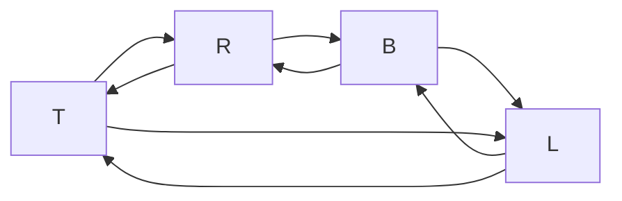

P={
    (T,T),(L,L),(R,R),(B,B)
    (B,L),(B,R),(B,T),(L,T)
    (R,T)
}

## Live Session

- final review
  - format
  - open book open note
  - 2 hours
    
    - keep open book ACST
    - class slides
    - written answer
    - 8:30 - 10:30 (10:45)
    - 4-5 questions
      - haskell programming
        - not required to submit the compiled code
        - trace the output of a recursive function
        - where is foldr, foldl, map, filter
        - where is recursion
        - language of propositional logic
        - curried functions
          - functions return functions as results
          - functions take arguments one at a time
        - higher order function
          - takes a function and returns a function as a result
      - BNF
        - given a grammar, validate the sentences
      - Kripke structures
      - Principal Expressions
        - access control statements
      - Access Control Formula statements

### Haskell Review
:type does not evaluate the expression, just returns the type
- syntax error
  - point out error or say no error
- (1+) successor function
- (1/) reciprocation function
- (/2) halving function
- (*2) doubling function
- Num, Eq, Ord types

#### Kripke structure
- [week 5 lectures](../CIS%20623%20Week%205%20Lectures.pdf)

W, I, J,

- I=P(W) maps each propositional variable p to a set of worlds 
- J=P(WxW) maps each principal name into a relation on worlds ( a subset of WxW)

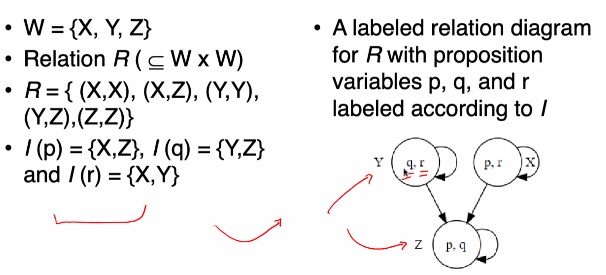

#### Evaluation of function

Em[p]=I(p)

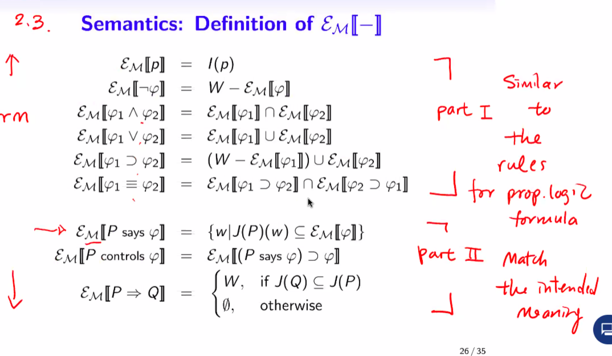

- example

J(p)={(w0,w0),(w1,w1),(w2,w1)}
J(q)={(w0,w2),(w0,w1),(w2,w0)}

find where w0 appears in a x coord of J(q)

J(p)|J(q)=J(p) o J(q)={(w0,w2),(w0,w1)}
J(q)|J(p)=J(q) o J(p)={(w2,w1),(w0,w0),(w1,w1)}

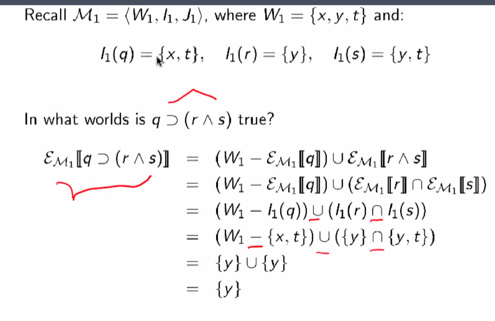

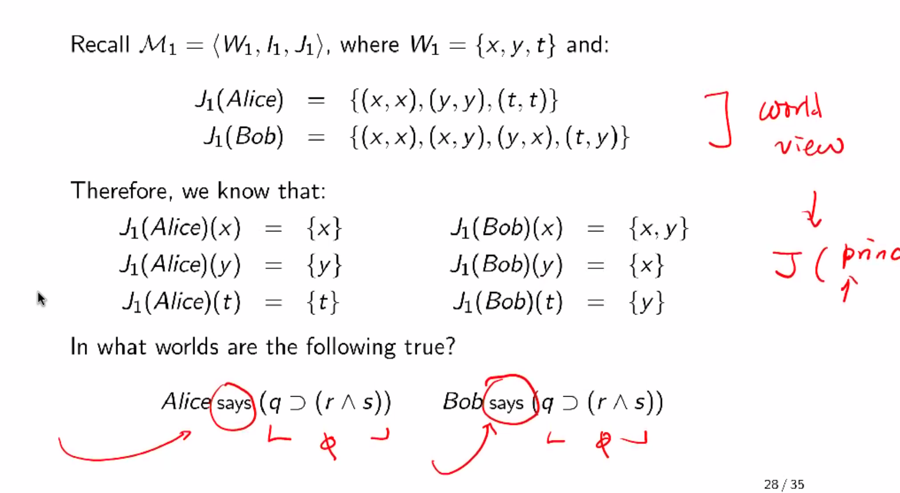
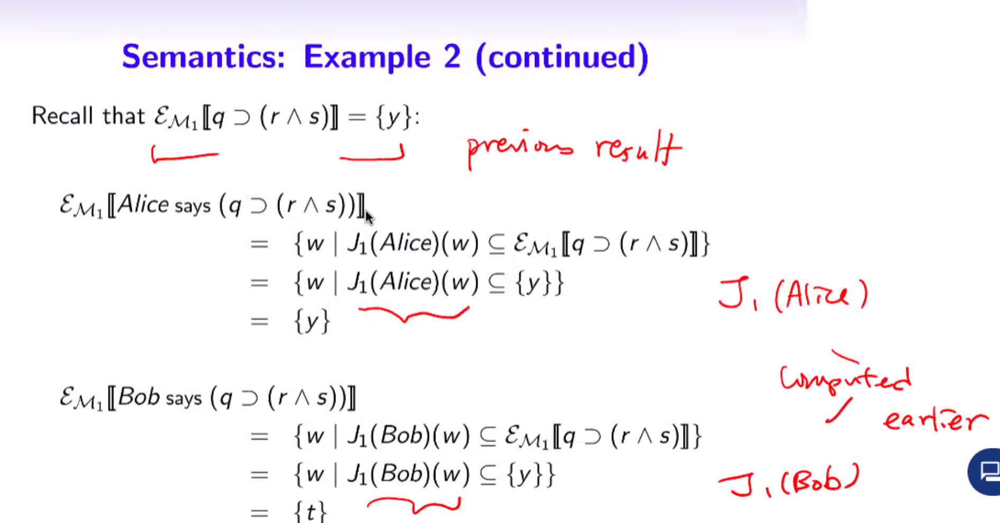

#### logical rules

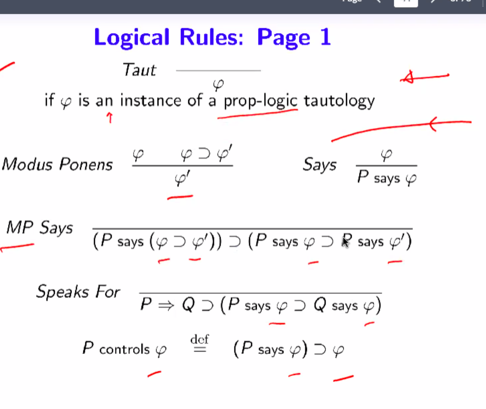
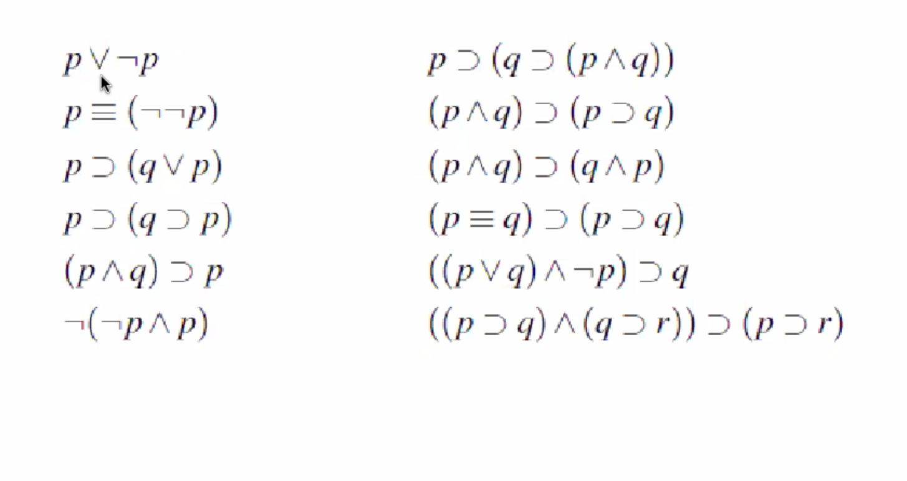
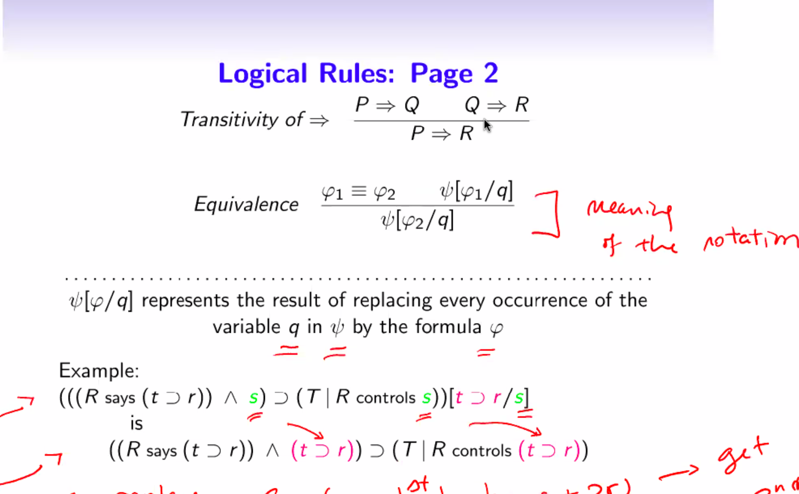

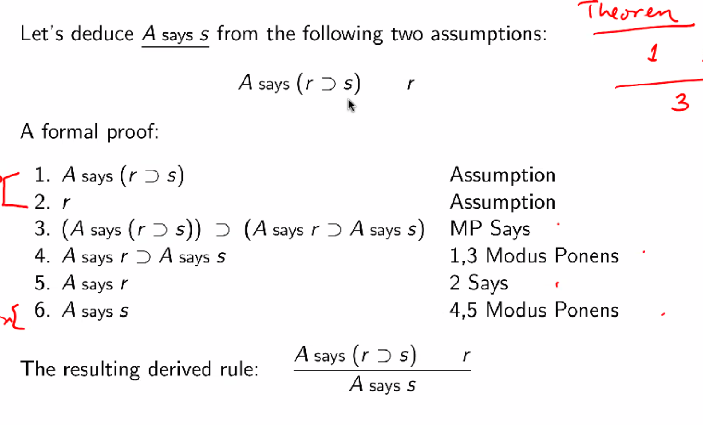
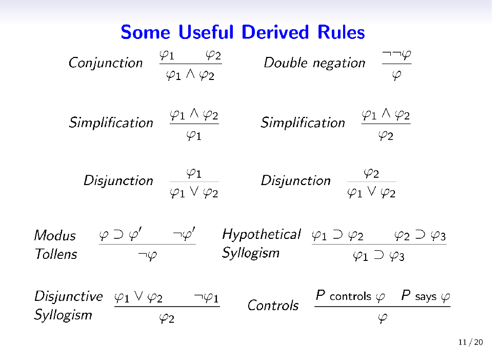
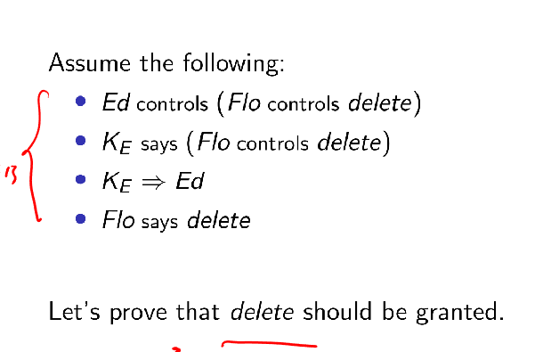
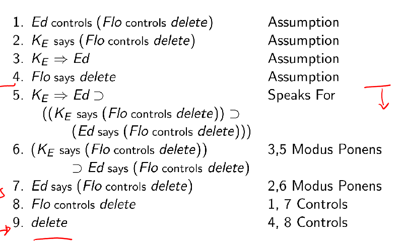

$\frac{P\rArr{}R\space{}R\rArr{}Q}{R\text{ says }\phi{}=P\&Q\text{ says }\phi{}}$

$\frac{P\rArr{}Q\space{}Q\rArr{}P}{P\text{ says }\phi{}=Q\text{ says }\phi{}}$

$\frac{}{P\&Q\text{ says }\phi{}=((P\text{ says }\phi{})\land{}(Q\text{ says }\phi{}))}$
$P\text{ controls }\phi{}=(P\text{ says }\phi{})\supset{}\phi{}$
$P\&Q\text{ controls }\phi{}$

a. $J_0(Hal \& Gil)$ 

- $J_0(Hal) = \{(sw,sw),(sc,sw),(ns,ns)\}$
- $J_0(Gil) = \{(sw,sw),(sc,sc),(ns,ns)\}$
$$
J_0(Hal)\cup{}J_0(Gil)\\
\{(sw,sw),(sc,sw),(ns,ns)\}\cup{}\{(sw,sw),(sc,sc),(ns,ns)\}\\
\{(sw,sw),(sc,sw),(ns,ns),(sc,sc)\}
$$

b. $J_0(Gil|Hal)$

- J_0(Gil) = {(sw,sw),(sc,sc),(ns,ns)}
- J_0(Hal) = {(sw,sw),(sc,sw),(ns,ns)}

=J0(Gil &sdot; Hal)
= {(sw,sw),(sc,sc),(ns,ns)}&sdot;{(sw,sw),(sc,sw),(ns,ns)}
= {(sw,sw),(sc,sw),(ns,ns)}

c. J_0(Flo & Ida)

- J_0(Flo) = {(sw,sw),(sw,sc),(sc,sw),(sc,sc),(ns,ns)}
- J_0(Ida) = {(sw,sc),(sc,sw),(ns,sc),(ns,ns)}

= J0(Flo &cup; Ida)
= {(sw,sw),(sw,sc),(sc,sw),(sc,sc),(ns,ns)} &cup;  {(sw,sc),(sc,sw),(ns,sc),(ns,ns)}
= {(sw,sw),(sw,sc),(sc,sw),(sc,sc),(ns,ns),(ns,sc)}

d. J_0(Hal|Ida)

- J_0(Hal) = {(sw,sw),(sc,sw),(ns,ns)}
- J_0(Ida) = {(sw,sc),(sc,sw),(ns,sc),(ns,ns)}

= J0(Hal &sdot; Ida)
= {(sw,sw),(sc,sw),(ns,ns)} &sdot; {(sw,sc),(sc,sw),(ns,sc),(ns,ns)}
= {(sw,sc),(sc,sc),(ns,sc),(ns,ns)}

- $W_0$ = {sw,sc,ns}
- $I_0$:PropVar&rArr;$P(\{sw,sc,ns\})$
  - where $I_0(g)=\{sw\}$
- $J_0(Gil) = \{(sw,sw),(sc,sc),(ns,ns)\}$
- $J_0(Flo) = \{(sw,sw),(sw,sc),(sc,sw),(sc,sc),(ns,ns)\}$
- $J_0(Hal) = \{(sw,sw),(sc,sw),(ns,ns)\}$
- $J_0(Ida) = \{(sw,sc),(sc,sw),(ns,sc),(ns,ns)\}$

a. $J_0(Hal \& Gil)$ 

- $J_0(Hal) = \{(sw,sw),(sc,sw),(ns,ns)\}$
- $J_0(Gil) = \{(sw,sw),(sc,sc),(ns,ns)\}$

$$
=\{(sw,sw),(sc,sw),(ns,ns)\}\cup{}\{(sw,sw),(sc,sc),(ns,ns)\}\\
=\{(sw,sw),(sc,sw),(ns,ns),(sc,sc)\}
$$

b. $J_0(Gil|Hal)$

- $J_0(Gil) = \{(sw,sw),(sc,sc),(ns,ns)\}$
- $J_0(Hal) = \{(sw,sw),(sc,sw),(ns,ns)\}$

$$
=\{(sw,sw),(sc,sc),(ns,ns)\}\circ{}\{(sw,sw),(sc,sw),(ns,ns)\}\\
=\{(sw,sw),(sc,sw),(ns,ns)\}
$$

c. $J_0(Flo\&Ida)$

- $J_0(Flo) = \{(sw,sw),(sw,sc),(sc,sw),(sc,sc),(ns,ns)\}$
- $J_0(Ida) = \{(sw,sc),(sc,sw),(ns,sc),(ns,ns)\}$

$$
=\{(sw,sw),(sw,sc),(sc,sw),(sc,sc),(ns,ns)\}\cup{}\{(sw,sc),(sc,sw),(ns,sc),(ns,ns)\}\\
=\{(sw,sw),(sw,sc),(sc,sw),(sc,sc),(ns,ns),(ns,sc)\}
$$

d. $J_0(Hal|Ida)$

- $J_0(Hal) = \{(sw,sw),(sc,sw),(ns,ns)\}$
- $J_0(Ida) = \{(sw,sc),(sc,sw),(ns,sc),(ns,ns)\}$

$$
\{(sw,sw),(sc,sw),(ns,ns)\}\circ{}\{(sw,sc),(sc,sw),(ns,sc),(ns,ns)\}\\
\{(sw,sc),(sc,sw),(ns,sc),(ns,ns)\}
$$

e. $J_0(Ida|Hal)$

- $J_0(Ida) = \{(sw,sc),(sc,sw),(ns,sc),(ns,ns)\}$\\
- $J_0(Hal) = \{(sw,sw),(sc,sw),(ns,ns)\}$

$$
\{(sw,sc),(sc,sw),(ns,sc),(ns,ns)\}\circ{}\{(sw,sw),(sc,sw),(ns,ns)\}\\
\{(sw,sw),(sw,sc),(ns,sw),(ns,ns)\}
$$

f. $J_0(Hal\&(Ida|Hal))$

- $J_0(Ida) = \{(sw,sc),(sc,sw),(ns,sc),(ns,ns)\}$\\
- $J_0(Hal) = \{(sw,sw),(sc,sw),(ns,ns)\}$

$$
J_0(Hal)\&(\{(sw,sc),(sc,sw),(ns,sc),(ns,ns)\}\circ{}\{(sw,sw),(sc,sw),(ns,ns)\})\\
J_0(Hal)\&\{(sw,sw),(sc,sw),(ns,sw),(ns,ns)\}\\
\{(sw,sw),(sc,sw),(ns,ns)\}\cup{}\{(sw,sw),(sc,sw),(ns,sw),(ns,ns)\}\\
\{(sw,sw),(sc,sw),(ns,ns),(ns,sw)\}
$$

g. $J_0(Hal|(Ida\&Hal))$

- $J_0(Ida) = \{(sw,sc),(sc,sw),(ns,sc),(ns,ns)\}$\\
- $J_0(Hal) = \{(sw,sw),(sc,sw),(ns,ns)\}$

$$
J_0(Hal)\circ{}(\{(sw,sc),(sc,sw),(ns,sc),(ns,ns)\}\cup{}\{(sw,sw),(sc,sw),(ns,ns)\})\\
J_0(Hal)\circ{}\{(sw,sc),(sc,sw),(ns,sc),(ns,ns),(sw,sw)\}\\
\{(sw,sw),(sc,sw),(ns,ns)\}\circ{}\{(sw,sc),(sc,sw),(ns,sc),(ns,ns),(sw,sw)\}
\{(sw,sc),(sc,sc),(sc,sw),(sw,sw),(ns,ns),(ns,sc)\}
$$

J(x)(AB,BC,DC,CC)
J(x')(AA,BD,CA,DA)

|state|x|x'|
|--|--|--|
|**A**|B|A|
|**B**|C|D|
|**C**|C|A|
|**D**|C|A|

Suppose there are two observers Bar and Foo. Both have faulty knowledge. When machine is in state A, Bar believes it to be in state D and vice-versa. Foo believes that machine is in state C when it is actually in state B. It perceives the other three states correctly. Find J(Bar) and J(Foo)

W={A,B,C,D}
J(bar)={(AD,BB,CC,DA)}
J(foo)={(AA,BC,CC,DD)}
 

Form = (Princ says Form)
 = (PName says Form)
 = (Jill says Form)
 = (Jill says (Form ⊃ Form))
 = (Jill says (PropVar ⊃ Form))
 = (Jill says (r ⊃ Form))
 = (Jill says (r ⊃ (Form ∨Form)))
 = (Jill says (r ⊃ (PropVar∨Form)))
 = (Jill says (r ⊃ (p∨Form)))
 = (Jill says (r ⊃ (p∨PropVar)))
 = (Jill says (r ⊃ (p∨q)))

  

Form ::= PropVar / &not; Form / (Form &or; Form) /
(Form &and; Form) / (Form &sup; Form) / (Form &equiv; Form) /
(Princ &rArr; Princ) / (Princ says Form) / (Princ controls Form)

2.2.1

a. ((p &and; &not;q) &sup; (Cal controls r))

((PropVar &or; &not;PropVar) &sup; (Cal controls r))
((Form &or; Form) &sup; (Cal controls r))
(Form &sup; (Cal controls r))
(Form &sup; (Cal controls PropVar))
(Form &sup; (Cal controls Form))
(Form &sup; Form)
Form

b. ((Gin &rArr; r) &and; q)

no, (Gin &rArr; r) is not a valid form

c. (Mel | Ned says (r &sup; t))

(Mel | Ned says (r &sup; t))
(Mel | Ned says (PropVar &sup; PropVar))
(Mel | Ned says (Form &sup; Form))
(Mel | Ned says Form)

no, because | is not defined in the BNF

d. (&not;t &rArr; Sal)

(&not;PropVar &rArr; Sal)
(&not;Form &rArr; Sal)
(Form &rArr; Sal)
(Form &rArr; Princ)

no, (Form &rArr; Princ) is not in the BNF

e. Ulf controls (Vic | Wes &rArr; Tor)

no because | is not defined in the BNF

f. (Pat controls (Quint controls (Ryne says s)))
(Pat controls (Quint controls (Princ says PropVar)))
(Pat controls (Quint controls (Princ says Form)))
(Pat controls (Quint controls (Princ says Form)))
(Pat controls (Quint controls Form))
(Pat controls (Princ controls Form))
(Pat controls Form)
(Princ controls Form)
Form

A = \<WA,IA, JA\> and B = \<WB,IB, JB\>
WA = {a1,a2,a3}
IA(p) = {a3}
IA(q) = {a1,a3}
IA(r) = {a1,a2}
JA(Val) = {(a1,a1),(a1,a2),(a2,a1),(a3,a2)}
JA(Wyn) = {(a1,a3),(a2,a3),(a3,a2)}.
WB = {b1,b2,b3,b4}
IB(p) = {b2,b1}
IB(q) = {b3}
IB(r) = {b2,b4,b1}
JB(Val) = {(b1,b2),(b2,b3),(b2,b4),(b4,b4)}
JB(Wyn) = {(b1,b1),(b2,b1),(b3,b2),(b3,b4),(b4,b2)}

which are true:

a. A = p &or; (q &sup; r)

W = {w0,w1,w2}
I(s) = {w1,w2}
I(t) = {w2}
J(Cy) = {(w1,w0),(w1,w1),(w2,w0)}
J(Di) = {(w0,w1),(w1,w0),(w2,w2)}

a. s &sup; t
Em(s &sup; t) = (W - Em(s)) &sup; Em(t)
= (W - Em(s)) &sup; Em(t)
= (W-I(s)) &sup; I(t)
= ({w0,w1,w2}-{w1,w2}) &sup; {w2}
= {w0} &sup; {w2}
= false

a. &not;(s &sup; t)
Em(s &sup; t) = (W - Em(s)) &sup; Em(t)
= (W - Em(s)) &sup; Em(t)
= (W-I(s)) &sup; I(t)
= ({w0,w1,w2}-{w1,w2}) &sup; {w2}
= {w0} &sup; {w2}
= false

Assured Programming and Formal Methods

EM [[p]] = I(p)
EM [[¬ϕ]] = W −EM [[ϕ]]
EM [[ϕ1 ∧ϕ2]] = EM [[ϕ1]]∩EM [[ϕ2]]
EM [[ϕ1 ∨ϕ2]] = EM [[ϕ1]]∪EM [[ϕ2]]
EM [[ϕ1 ⊃ ϕ2]] = (W −EM [[ϕ1]])∪EM [[ϕ2]]
EM [[ϕ1 ≡ ϕ2]] = EM [[ϕ1 ⊃ ϕ2]]∩EM [[ϕ2 ⊃ ϕ1]]
EM [[P ⇒ Q]] = (
W, if J(Q) ⊆ J(P)
0/, otherwise
)
EM [[P says ϕ]] = {w|J(P)(w) ⊆ EM [[ϕ]]}
EM [[P controls ϕ]] = EM [[(P says ϕ) ⊃ ϕ]]

W = {w0,w1,w2}
I(s) = {w1,w2}
I(t) = {w2}
J(Cy) = {(w1,w0),(w1,w1),(w2,w0)}
J(Di) = {(w0,w1),(w1,w0),(w2,w2)}

a. s ⊃ t
= Em(s&sup;t)=(W-EM(s)) &cup; EM(t)
= ({w0,w1,w2}-{w1,w2}) &cup; {w2}
= {w0} &cup; {w2} 
= {w0,w2}

b. ¬(s ⊃ t)
= W-{w1}
= {w1}

c. Cy says (s ⊃ t)
= Cy says {w1}
= {w|J(P)(w) &supe; Em ({w0,w2})}
J(w0)={}
J(w1)={w0,w1}
J(w2)={w0}

= {{w2} &supe; {w0,w2}}
= {w2}

d. Cy says ¬(s ⊃ t)
Cy says {w1}
= {w|J(P)(w) &supe; Em ({w1})}
J(w1)={w0,w1}
J(w2)={w0}
&empty;

e. Di says (s ⊃ t)

= Di says {w1}
= {w|J(P)(w) &supe; Em ({w0,w2})}
J(w0)={w1}
J(w1)={w0}
J(w2)={w2}
{w1,w2}

f. Di says ¬(s ⊃ t)
g. (Cy & Di) says (s ⊃ t)
h. (Cy & Di) says ¬(s ⊃ t)
i. (Di | Cy) says (s ⊃ t)
j. (Di | Cy) says ¬(s ⊃ t)
k. Di ⇒ Cy
l. Cy says (Di ⇒ Cy)
m. Di says (Di ⇒ Cy)
n. Di says (Di & Cy ⇒ Cy)

proof

1. Al says (r &sup; s)       :: assumption
2. r                         :: assumption
3. Al says (r &sup; s) &sup; Al says r &sup; Al says s :: MP Says, 1
4. Al says r &sup; Al says s :: MP 1, 3
5. Al says r                 :: Says 2
6. Al says s                 :: MP 4,5

$\frac{P\text{ says }\phi{}_1\space{}P\rArr{}Q}{Q\text{ says }(\phi{}_2\supset{}\phi{}_1)}$

1. P says &phi;1 ::  Assumption
2. P &rArr; Q :: Assumption
3. Q says &phi;1 ::  1,2 Derived speaks for
4. &phi;1 :: 3 Says
5. &phi;1 &sup; (&phi;2 &sup; &phi;1) :: 4 taut
6. Q says (&phi;2 &sup; &phi;1) :: 5,3 Modus Ponens

$\frac{P\text{ says }(Q \text{ controls } \phi{})\space{}P|Q\text{ says }\phi{}}{P\text{ says }\phi{}}$

1. P says (Q controls &phi;) :: assumption
2. P|Q says &phi;   :: assumption
3. P says Q says &phi; :: 2,quoting
4. P says ((Q says &phi;) &sup; &phi;)  :: 1, controls def
5. P says &phi; :: 2, says
