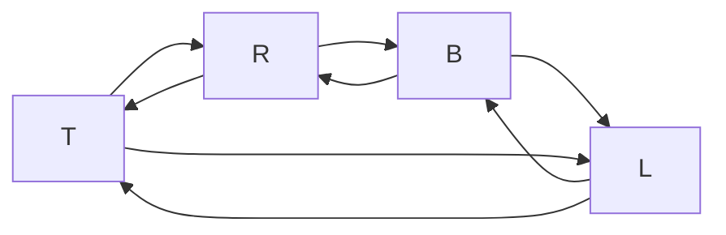

# Week 10 Applying Formal Methods Part 5
## Table of Contents
- [Week 1 Introduction](../week1/README.md)
- [Week 2 Beginning Steps](../week2/README.md)
- [Week 3 Programming Paradigms Part 1](../week3/README.md)
- [Week 4 Formal Methods and Programming](../week4/README.md)
- [Week 5 Applying Formal Methods Part 1](../week5/README.md)
- [Week 6 Applying Formal Methods Part 2](../week6/README.md)
- [Week 7 Programming Paradigms Part 2](../week7/README.md)
- [Week 8 Applying Formal Methods Part 3](../week8/README.md)
- [Week 9 Applying Formal Methods Part 4](../week9/README.md)
- **&rarr;[Week 10 Applying Formal Methods Part 5](README.md)**

### Learning Objectives

- State and discuss the concept of confidentiality and integrity levels within the context of access control.
- Give refinements to the security models (Bell La Padula and Biba models) to incorporate the new definitions regarding the confidentiality and integrity levels.
- Use examples to illustrate the merits of using these security models (to define access control policies) in protecting the confidentiality and/or the integrity of a system.

### Overview

- refinement: security models (mandatory security polices)
- incorporate information categories in the classification
- security levels and integrity levels are partially ordered but not necessarily linearly ordered
- bell-la padula models (protect confidentiality)
- biba models (protect integrity)

### Biba Model

#### commercial integrity policies
- primary concent: integrity
  - protecting system and its resources from damage
    - contamination
    - corruption
    - misuse
- integrity levels
  - octane ratings on gas
  - frequent-flyer status: early access to seats and airport lounges

> maintain quality rather than confidentiality

#### semantics

- M = (W,I,J,K,L,&alpha;)

enhance evaluation function Em
- Em[[l1 &leq; l2]]
- Em[[l1 = l2]]

#### Kripke Semantics and Inference Rules

##### Kripke Semantics

\[
\mathcal{E}_M [\ell_1 \leq_I \ell_2] = 
\begin{cases} 
W, & \text{if } L(\ell_1) \preceq L(\ell_2) \\ 
\emptyset, & \text{otherwise} 
\end{cases}
\]

\[
\mathcal{E}_M [\ell_1 =_I \ell_2] = \mathcal{E}_M [\ell_1 \leq_I \ell_2] \cap \mathcal{E}_M [\ell_2 \leq_I \ell_1]
\]

##### Inference Rules

\[
\ell_1 =_I \ell_2 \overset{\text{def}}{=} (\ell_1 \leq_I \ell_2) \land (\ell_2 \leq_I \ell_1)
\]

**Reflexivity of** \(\leq_I\):  
\[
\ell \leq_I \ell
\]

**Transitivity of** \(\leq_I\):  
\[
\frac{\ell_1 \leq_I \ell_2 \quad \ell_2 \leq_I \ell_3}{\ell_1 \leq_I \ell_3}
\]

\[
\frac{il(P) =_I \ell_1 \quad il(Q) =_I \ell_2 \quad \ell_1 \leq_I \ell_2}{il(P) \leq_I il(Q)}
\]

### Biba Strict Integrity Policy

- Biba definition of computer system
  - The concern of computer system integrity is thus the guarantee that a subsystem will perform as it is intended.
  - the integrity problem is the formulation of access control

#### Subjects Objects and Access

- three kinds of access
  1. observation: viewing of information by a subject - includes execution
  2. modification: changing an object's state
  3. invocation: a request for service by one subject of another

#### Transfer paths
- definition
  - a transfer path is a sequence of objects O1...On+1 and subjects S1...Sn such that
    - Sn can observe/take On
    - Sn can modify/put On+1

> strict integrity prevents corruption of  subjects and objects

#### Example
- chapter 5

### Confidentiality and Integrity Levels

#### Military Security Policies

- primary concern: confidentiality
  - information is protected on a need to know basis
  - flow of information is governed by classification levels
- bell la padula model
  - subjects cannot read information at higher classification levels "no read up"
  - subjects cannot write information to lower classification levels "no write down"

**Kripke semantics and Inferences rules**

- partial oder is a relation that is reflexive, anti symmetric, transitive

#### commercial polices

**Kripke sematintics and Inferences rules**

- partial order , reflexive, antisymmetric, transitive

#### Partial-order Relation

- a relation &leq; on a set A (ie &leq; &subseteq; AxA) is a partial order provided &leq; is reflexive, anti-symmetric, and transitive 
- in addition, if the partial order &leq; satisfies the totality condition

&forall; x, y &in; A, either x&leq;y or y&leq;x
- we will call the relation &leq; a total order

#### Hasse Diagram

- when A is finite, a partial order &leq; on A is often represented by a Hasse diagram, which is a directed graph H, where:
  - each element in A is a vertex of H
  - an edge from x (higher) to y (lower) is drawn whenever x &ne; and ther eis no z (z&ne;x,z&ne;y) with x&leq;z&leq;y
  - confidentiality and integrity levels for the extended Kripke structures are rperesnted by Hasse diagrams

#### Example

P={
    (T,T),(L,L),(R,R),(B,B)
    (B,L),(B,R),(B,T),(L,T)
    (R,T)
}

## Live Session

- final review
  - format
  - open book open note
  - 2 hours
    
    - keep open book ACST
    - class slides
    - written answer
    - 8:30 - 10:30 (10:45)
    - 4-5 questions
      - haskell programming
        - not required to submit the compiled code
        - trace the output of a recursive function
        - where is foldr, foldl, map, filter
        - where is recursion
        - language of propositional logic
        - curried functions
          - functions return functions as results
          - functions take arguments one at a time
        - higher order function
          - takes a function and returns a function as a result
      - BNF
        - given a grammar, validate the sentences
      - Kripke structures
      - Principal Expressions
        - access control statements
      - Access Control Formula statements

### Haskell Review
:type does not evaluate the expression, just returns the type
- syntax error
  - point out error or say no error
- (1+) successor function
- (1/) reciprocation function
- (/2) halving function
- (*2) doubling function
- Num, Eq, Ord types

#### Kripke structure
- [week 5 lectures](../CIS%20623%20Week%205%20Lectures.pdf)

W, I, J,

- I=P(W) maps each propositional variable p to a set of worlds 
- J=P(WxW) maps each principal name into a relation on worlds ( a subset of WxW)

#### Evaluation of function

Em[p]=I(p)

- example

J(p)={(w0,w0),(w1,w1),(w2,w1)}
J(q)={(w0,w2),(w0,w1),(w2,w0)}

find where w0 appears in a x coord of J(q)

J(p)|J(q)=J(p) o J(q)={(w0,w2),(w0,w1)}
J(q)|J(p)=J(q) o J(p)={(w2,w1),(w0,w0),(w1,w1)}

#### logical rules

