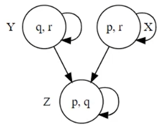
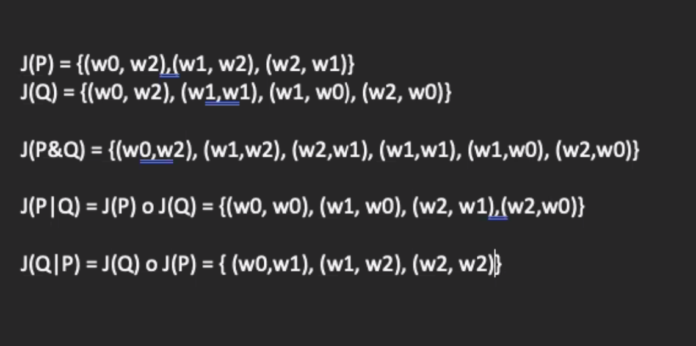

# Week 5 Applying Formal Methods Part 1
## Table of Contents
- [Week 1 Introduction](../week1/README.md)
- [Week 2 Beginning Steps](../week2/README.md)
- [Week 3 Programming Paradigms Part 1](../week3/README.md)
- [Week 4 Formal Methods and Programming](../week4/README.md)
- **&rarr;[Week 5 Applying Formal Methods Part 1](README.md)**
- [Week 6 Applying Formal Methods Part 2](../week6/README.md)
- [Week 7 Programming Paradigms Part 2](../week7/README.md)
- [Week 8 Applying Formal Methods Part 3](../week8/README.md)
- [Week 9 Applying Formal Methods Part 4](../week9/README.md)
- [Week 10 Applying Formal Methods Part 5](../week10/README.md)

**Jump to**
- [Common Propositional-Logic Tautologies](#common-propositional-logic-tautologies)

### Learning Objectives

- Identify both the construction of formal proofs and property testing via randomly generated instances as major techniques in formal methods.
- State the meaning of a logical rule (a.k.a. inference rule) and its components (hypotheses/premises, consequence/conclusion).
- Describe the basic axioms of access control logic as logic rules of access control logic and use them in reasoning about access control.
- Give examples of derived inference rules and demonstrate their validities by showing a formal proof for each derived rule.
- Apply formal methods to specify, implement, test and verify the Set Data type written in Haskell language.

### Formal Methods: Model Checking and Reasoning

- access-control properties
  - semantics: kripke model
  - model-checking problem
    - given a kripke model and an access-control property, for which word in the model is the property true
- model-checking problem
  - the key to solving the model-checking problem is to implement the evaluation function, where creating a Set data type is the beginning step.
- reasoning: inference rules, formal proofs, and proof trees

### Kripke Models

Access-Control Properties and Kripke Structures

- P says &Phi;
  - Principal P makes the statement
- P controls &Phi;
  - Principal P has jurisdiction over statement &Phi;
- P &rArr; Q
  - P speaks for Q

#### Towards More Precision
- tautologies
  - which formulas are true in all cases
- contradictions
- follow others?
- how can re reason about htese

#### Kripke Structure

- a Kripk structure M is a a three tuple <W, I, J>
  - W is a nonempty set, whose elements are called worlds
  - I: PropVar -> P(W) is an interpretation function that maps each propostional variable p to a set of worlds
  - J: PName -> P(W x W) is a function that maps each principal name A into a relation on worlds (ie a subset of W x W)

- Intuition: Truth Tables for a modal logic!
  - I is the Kripke-equivalent of a truth assignment: I(p) is the set of worlds in which p is true
  - J(A) is a relation describing how A views various worlds:
    - each pair (w,w')&in;J(A) indicates that , when the current world is w, principal A believes current worlds might be w'


#### Labeled Relations as Graphs
- W = {X,Y,Z}
- relation R (&sube; W x W)
- R = {(X,X), (X,Z), (Y,Y), (Y,Z) (Z,Z)}
- I(p)={X,Z}, I(q)={Y,Z} and I(r)={X,Y}

- a labeled relation diagram for R with propostion variables p, q, and r labeled according to I



#### Kripke Structure: Simple Example

- **M0** is a Kripke structure, where:
  - **W0** = {sw, sc, ns}
  - **I0** : PropVar → P(W0), such that
    - **I0(go)** = {sw}
  - **J0** : PName → P(W0 x W0), such that
    - **J0(Gil)** = {(sw, sw), (sc, sc), (ns, ns)}
    - **J0(Flo)** = {(sw, sw), (sw, sc), (sc, sw), (sc, sc), (ns, ns)}
    - **J0(Hal)** = {(sw, sw), (sc, sw), (ns, ns)}

- **Knowledge Interpretations:**
  - Gil has **perfect knowledge** about the worlds.
  - Flo has **uncertainty** in worlds sw and sc.
  - Hal has a **mistaken belief** in world sc.


#### Kripke Structures: Another Example

- **M1** = (W1, I1, J1) is a Kripke structure, where:
  - **W1** = {x, y, t}
  - **I1** : PropVar → P(W1), such that
    - **I1(q)** = {x, t}
    - **I1(r)** = {y}
    - **I1(s)** = {y, t}
  - **J1** : PName → P(W1 x W1), such that
    - **J1(Alice)** = {(x, x), (y, y), (t, t)}
    - **J1(Bob)** = {(x, x), (x, y), (y, t), (t, y)}

This structure provides another illustration of how propositions and relations are defined within a Kripke model.


> The question is: Given a model and formula, can you compute whether that formula is true in that model? We need what we call an evaluation function.

### THe Model-Checking Problem
The evaluation function: definition and calculations

#### Semantics: Definition of EM[-]

> section 2.3 of the text

- part 1 similar to the rules for propositional logic formula
  - **EM[p]** = I(p)
  - **EM[¬φ]** = W − EM[φ]
  - **EM[φ1 ∧ φ2]** = EM[φ1] ∩ EM[φ2]
  - **EM[φ1 ∨ φ2]** = EM[φ1] ∪ EM[φ2]
  - **EM[φ1 ⇒ φ2]** = (W − EM[φ1]) ∪ EM[φ2]
  - **EM[φ1 ≡ φ2]** = (EM[φ1 ⇒ φ2] ∩ EM[φ2 ⇒ φ1])
- part 2 match the intended meaning
  - **EM[P says φ]** = {w | J(P)(w) ⊆ EM[φ]}
  - **EM[P controls φ]** = EM[P says φ] ⊇ φ
  - **EM[P ⇒ Q]** = 
    - {W, if J(Q) ⊆ J(P)}
    - ∅, otherwise

#### Compound Principals

- two operators combine principal expressions
  - P & Q informally denotes P with Q
  - P | Q informally denotes P quoting Q

Semantics:
- J(P&Q) = J(P) &cup; J(Q)
- J(P|Q) = J(P) &#8728; J(Q)

#### Semantics Example 1

Recall **M1** = (W1, I1, J1), where W1 = {x, y, t} and:

- **I1(q)** = {x, t}
- **I1(r)** = {y}
- **I1(s)** = {y, t}

In what worlds is **q ⊃ (r ∧ s)** true?

- **EM1[q ⊃ (r ∧ s)]** 
  = (W1 − EM1[q]) ∪ EM1[r ∧ s]
  = (W1 − EM1[q]) ∪ (EM1[r] ∩ EM1[s])
  = (W1 − I1(q)) ∪ (I1(r) ∩ I1(s))
  = (W1 − {x, t}) ∪ ({y} ∩ {y, t})
  = {y} ∪ {y}
  = {y}

#### Semantics Example 2

Recall **M1** = (W1, I1, J1), where W1 = {x, y, t} and:

- **J1(Alice)** = {(x, x), (y, y), (t, t)}
- **J1(Bob)** = {(x, x), (x, y), (y, x), (t, y)}

Therefore, we know that:
- **J1(Alice)(x)** = {x}
- **J1(Alice)(y)** = {y}
- **J1(Alice)(t)** = {t}
- **J1(Bob)(x)** = {x, y}
- **J1(Bob)(y)** = {x}
- **J1(Bob)(t)** = {y}

In what worlds are the following true?

- **Alice says (q ⊃ (r ∧ s))**
- **Bob says (q ⊃ (r ∧ s))**

### The Set Type

#### A Data Type for Sets

- sets are collections of elements. We consider those that are:
  - finite
  - contain elements of the same type
- remarks
  - sets and lists are similar, but not the same
  - sets are not necessarily ordered and multiple occurrences of the sma element are ignored

#### The Set Data Type

- representation
- Type `newtype Set a = Set [a]`
- the newtype construction has the same effect as using the data mechanism with one constructor (ie Set)
- to implement the usual set operations effectively, the type a should be a member of the Eq class


#### Set Operations

the set data type is expected to support usual set operations it will include
- union (&cup;), intersection (&intersect;), ,difference (-) and cardinality operations. we may also implement operations to compute symmetric difference and power sets
- the membership (&in;) subset (&sub;) and equal (=) relations
- operations to display (show) the elements of a set


#### Design Considerations
- implement as an ordered set (or not)?
- how do you handle repetitions in the underlying list?
- are there any additional operations/functions (eg higher-order functions) that will enhance set manipulations?
- can we make sure of functions from the Prelude

#### Initial Steps
- represent a aset as an ordered list of elements without repetitions and declare set as the data type

```hs
newtype Set a = Set [a]
```
- where the underlying elements are stored in a list
- specify the types of each operation/function to be implemented
- identify functions form the Prelude for processing lists that may help

### Implementing Set Operations via Recursion: Examples

- [5-5-2.lhs](./5-5-2/5-5-2.lhs)
- [Set.lhs](./5-5-2/Set.lhs)


### The Set Data Type II

List comprehensions allow many functions on lists to be defined by translating from the definition of a set

| Define a Set S via set-builder notation | Define a List L that represents S via list comprehension |
|-----------------------------------------|----------------------------------------------------------|
| S = {x ∈ A | p(x)}                      | L = [x ← A | p(x)]                                       |

#### Practice
- define the intersection of two sets formally in set notations and translate it into haskell code:
- A,B are sets
- A&#8898;B={x|(x&in;A)&and;(x&in;B)}
- inter A B = []

#### Implement Set Operations via List Comprehension: Examples

- [5-6-2.lhs](./5-6-2/5-6-2.lhs)
- [5-6-2-after.lhs](./5-6-2/5-6-2-after.lhs)
- [Set.lhs](./5-6-2/Set.lhs)

### Reasoning and Access Control: Introduction

#### How do we use the logic?

- no one wants to do analysis on kripke structures
  - cumbersome
  - it's not clear which structure to use in a given situation
  - However, they provide precise meaning for our formulas
- thus to support a feasible and legitimate analysis, we need

1. a set of rules that lets us manipulate formulas in our logic as a way of calculating the consequences of certain assumptions.

> If H1...Hk are all true, then C is true

$$\frac{H_1...H_k}{C}$$

2. Confidence that the rules "make sense" and reflect the underlying semantics: any kripke structure that satisfies H1...Hk should also satisfy C

#### Logical Rules: Page 1
- Tautology (Taut)
If &phi; is an instance of a propositional logic tautology:

$\frac{}{\varphi}$

- Modus Ponens

$\frac{\varphi \quad \varphi \supset \varphi'}{\varphi'}$


- Says

$\frac{\varphi}{P \text{ says } \varphi}$

- MP Says

$\frac{(P \text{ says } (\varphi \supset \varphi')) \quad (P \text{ says } \varphi)}{P \text{ says } \varphi'}$

- Speaks For

$\frac{P \supset Q}{(P \text{ says } \varphi \supset Q \text{ says } \varphi)}$

- Controls

$P \text{ controls } \varphi \quad \overset{\text{def}}{=} \quad (P \text{ says } \varphi \supset \varphi)$

#### Common Propositional Logic Tautologies

- $p \lor \neg p$
- $p \equiv (\neg \neg p)$
- $p \supset (q \lor p)$
- $p \supset (q \supset p)$
- $(p \land q) \supset p$
- $\neg (\neg p \land p)$


- $p \supset (q \supset (p \land q))$
- $(p \land q) \supset (p \supset q)$
- $(p \land q) \supset (q \land p)$
- $(p \equiv q) \supset (p \supset q)$
- $((p \lor q) \land \neg p) \supset q$
- $((p \supset q) \land (q \supset r)) \supset (p \supset r)$

#### Using the Taut Rule
- (p&or;&not;p) is a tuatology
- the taut rule can infer

> (Paul controls (read &and; write)) &or; &not; (Paul controls (read &and; write))

- when applying the taut rule(s), we need to identify suitable tautologies


#### Logical Rules: page 2

**Transitivity of &rArr;**

$\frac{P \rArr Q \quad Q \rArr R}{P \rArr R}$

**Equivalence**

$\frac{\varphi_1 \equiv \varphi_2}{\psi[\varphi_1 / q] \quad \psi[\varphi_2 / q]}$


<hr>
- &Psi;[&Phi;/q] represents the result of replacing every occurence of the variable q in &Psi; by the formula &Phi;

- example:

> (((R say (t &sup; r)) &and; S) &sup; (T|R controls s)[t &sup; r/s]
is
> ((R says (t &sup; r)) &and; (t &sup; r)) &sup; (T|R controls (t &sup; r))

#### Proofs Using the Rules

- a **formal proof** is a squence of annotated statements in the logic, where each statement is on eof the following
- an assumption (annotated by "Assumption")
- Obtaineed bu applying one of the axioms, definitions, or logical rules to previous statements in that sequence (annotated with appropriate rule)

- Every formal proof yields a theorem (derived inference rule)

$$\frac{H_1...H_c}{C}$$

where H1...Hk are the only assumptions of the proof and C is the final statement

### Formal Proofs via Inference Rules

H1_____1_____H1______(assumption)
H2_____2_____H2______(assumption)
H3_____3_____H3______(assumptions)
C_____4 _____..._____(may use 1,2,3 and existing reference rules)


- figure 3.1 chapter, explanation on why those rules are accepted is discussed in chapter 3 section 1


#### Sample Deduction Proof

Let's deduce A says s from the following two assumptions:


- $A \text{ says } (r \supset s)$
- $r$

**Sample formal proof:**

| Step | Statement                                   | Justification         |
|------|---------------------------------------------|-----------------------|
| 1    | A says (r ⊃ s)                              | Assumption            |
| 2    | r                                           | Assumption            |
| 3    | (A says (r ⊃ s)) ⊃ (A says r ⊃ A says s)    | MP Says               |
| 4    | A says r ⊃ A says s                         | 1, 3 Modus Ponens     |
| 5    | A says r                                    | 2 Says                |
| 6    | A says s                                    | 4, 5 Modus Ponens     |

The resulting derived rule:

$
\frac{A \text{ says } (r \supset s) \quad r}{A \text{ says } s}
\]


- if 1 and 2 are true, 3 is true


#### More sample proofs

- proofs for derived rules:

**Proof of (A)**

$
\frac{P \text{ controls } \varphi \quad P \text{ says } \varphi}{\varphi}
\]

| Step | Statement                         | Justification             |
|------|-----------------------------------|---------------------------|
| 1    | P controls &phi;            | Assumption                |
| 2    | P says &phi;                | Assumption                |
| 3    | (P says &phi;) ⊃ &phi; | 1 Definition of controls  |
| 4    | &phi;                       | 2, 3 Modus Ponens         |

**Proof of (B)**

$
\frac{\varphi_1 \quad \varphi_2}{\varphi_1 \land \varphi_2}
$

| Step | Statement                               | Justification             |
|------|-----------------------------------------|---------------------------|
| 1    | $\varphi_1$                          | Assumption                |
| 2    | $\varphi_2$                          | Assumption                |
| 3    | $\varphi_2 \supset (\varphi_1 \supset (\varphi_1 \land \varphi_2))$| Tautology                |
| 4    | $\varphi_2 \supset (\varphi_1 \land \varphi_2)$| 1, 3 Modus Ponens         |
| 5    | $\varphi_1 \land \varphi_2$          | 2, 4 Modus Ponens         |


### Reasoning and Access Control: Proofs

#### Derived Inference Rules

**Conjunction**
$
\frac{\varphi_1 \quad \varphi_2}{\varphi_1 \land \varphi_2}
$

**Double Negation**
$
\frac{\neg \neg \varphi}{\varphi}
$

**Simplification**
$
\frac{\varphi_1 \land \varphi_2}{\varphi_1}
$

**Simplification**
$
\frac{\varphi_1 \land \varphi_2}{\varphi_2}
$

**Disjunction**
$
\frac{\varphi_1}{\varphi_1 \lor \varphi_2}
$

**Disjunction**
$
\frac{\varphi_2}{\varphi_1 \lor \varphi_2}
$

**Modus Tollens**
$
\frac{\varphi \supset \varphi' \quad \neg \varphi'}{\neg \varphi}
$

**Hypothetical Syllogism**
$
\frac{\varphi_1 \supset \varphi_2 \quad \varphi_2 \supset \varphi_3}{\varphi_1 \supset \varphi_3}
$

**Disjunctive Syllogism**
$
\frac{\varphi_1 \lor \varphi_2 \quad \neg \varphi_1}{\varphi_2}
$

**Controls**
$
\frac{P \text{ controls } \varphi \quad P \text{ says } \varphi}{\varphi}
$


#### You should know

- Figure 3.1
  - basic rules

- Figure 3.5
  - derived rules

- useful to construct proofs

#### Working Through a Formal Proof
- assume the following (hypothesis)
  - Ed controls (Flow controls delete)
  - KE say s (Flow controls delete)
  - KE &rArr; Ed
  - Flow says delete

- conclusion
  - > let's prove that delete should be granted


## Proof for Derived Rule

| Step | Statement                                           | Justification         |
|------|-----------------------------------------------------|-----------------------|
| 1    | Ed controls (Flo controls delete)                   | Assumption            |
| 2    | K_E says (Flo controls delete)                  | Assumption            |
| 3    | K_E &rArr; Ed                                  | Assumption            |
| 4    | Flo says delete                                     | Assumption            |
| 5    | K_E &rArr; Ed ⊃ ((K_E says (Flo controls delete)) ⊃ (Ed says (Flo controls delete))) | Speaks For            |
| 6    | ((K_E  says  (Flo controls delete)) ⊃ (Ed says (Flo controls delete))) | 3, 5 Modus Ponens     |
| 7    | (K_E says (Flo controls delete)) ⊃ (Ed says (Flo controls delete)) | 2, 6 Modus Ponens     |
| 8    | Ed says (Flo controls delete)                       | 4, 8 Controls         |
| 9    | Flo controls delete                                 | 1, 7 Controls         |
| 10   | delete                                              | 4, 8 Controls         |

### Formal Proofs and Proof Trees

#### Constructing a Formal Proof

- how do you construct a formal proof?
- finding a proof is like performing a search
- work from the hypothesis (forward)
- work from the conclusion (backward)
- consider relevant inference rules by pattern matching
- what is the overall structure of a proof?

<hr>

- work backwards
  - construct proof tree
  - each step
    - : match one inference rule
    - : determine a list of "sub"goals

#### Sample Formal Proof

Let's deduce A says r  from the following two assumptions:

- $A \text{ says } (r \supset s)$
- $r$

**A formal proof**:

| Step | Statement                                   | Justification         |
|------|---------------------------------------------|-----------------------|
| 1    | A says (r ⊃ s)                              | Assumption            |
| 2    | r                                           | Assumption            |
| 3    | (A says (r ⊃ s)) ⊃ (A says r ⊃ A says s)    | MP Says               |
| 4    | A says r ⊃ A says s                         | 1, 3 Modus Ponens     |
| 5    | A says r                                    | 2 Says                |
| 6    | A says s                                    | 4, 5 Modus Ponens     |

The resulting derived rule:

$\frac{A \text{ says } (r \supset s) \quad r}{A \text{ says } s}$


## Live Session

This will be on the final


for proofs, whenever you have formulas "speaks for" or "controls" expand them! have the proof definitions around for the final. it will be open note